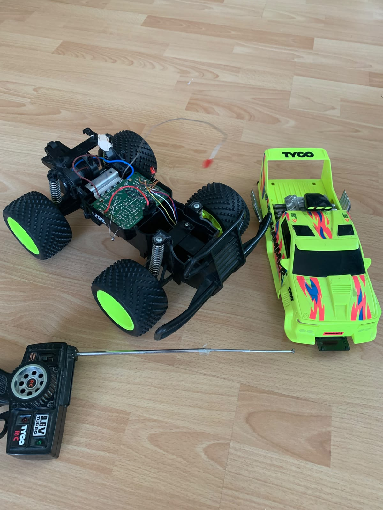
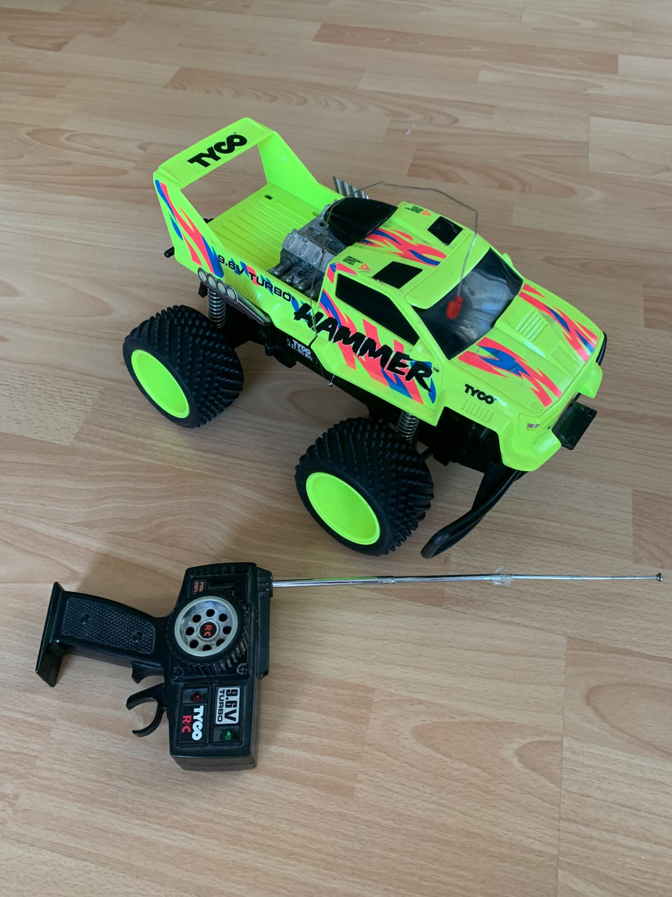
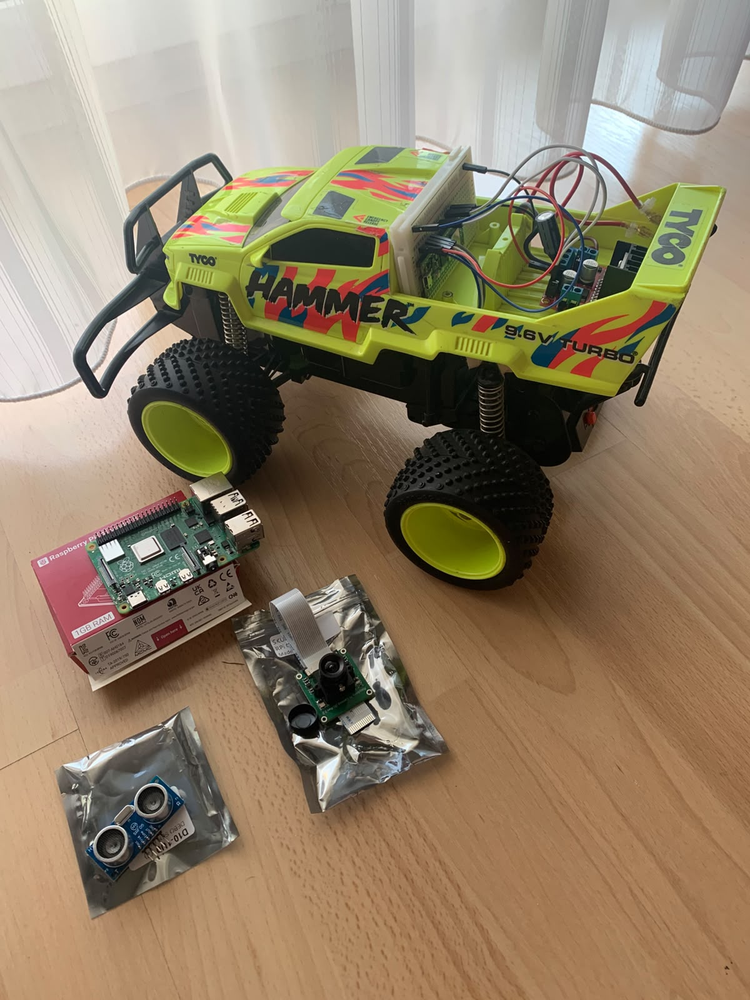

# iot-adas-rc-car-hub

# 🚗 IoT ADAS RC Car System Hub

> ⚠️ **Project Status: Ongoing / Active Development**  
> This is a personal learning project and is currently under active construction. New features, documentation, and hardware components (like the Raspberry Pi 4 integration) are added continuously.

This is the central overview repository for my **IoT ADAS RC Car Project**. 

The goal of this project is to build a modular, remote-controlled vehicle ecosystem driven by modern driver assistance and autonomous features. Components communicate asynchronously using the **MQTT protocol**.

---

## 📐 System Architecture & Sub-Repositories

The ecosystem is split into independent, clean repositories. You can explore the source code here:

*   **[Pico 2WH Firmware](https://github.com)**
    *   Processes MQTT control commands (WASD) from the dashboard and drives the motor driver via GPIO.
    *   Features built-in safety logic to protect the drivetrain (e.g., prevents immediate shifting from forward to reverse).
    *   Sends real-time telemetry and debug messages back to the operator.
*   **[Qt Desktop Dashboard](https://github.com/domiL-dev/qt-dashboard-iot-adas-rc-car)**
    *   A desktop control station built in C++ and Qt 6.
    *   Captures keyboard inputs for vehicle control and displays a live debug/telemetry terminal.
*   **[Gateway & Camera Pi 4](https://github.com)** *(Coming Soon)*
    *   Planned for learning Embedded Linux, streaming camera video to the dashboard, and implementing autonomous driving functions using OpenCV.

---

## 📸 Hardware Setup & Images

### Overall original Vehicle View

Here you can see the actual state of the physical layout, wiring, and assembly of the RC Car:

### Overall IoT Vehicle View and future components (actual state)

---

## 🚀 Project Status & Roadmap
- [x] Establish stable Wi-Fi & MQTT connection on Raspberry Pi Pico 2WH.
- [x] Implement asynchronous WASD driving controls via Qt Dashboard.
- [x] Integrate drivetrain protection algorithms (e.g. Forward/Reverse transition delay).
- [ ] Implement remote-controlled toggle for Pico debug messages in the dashboard terminal.
- [ ] loading.....

## Coming soon...
- [ ] Set up Raspberry Pi 4 with Custom Embedded Linux for video streaming.
- [ ] Integrate OpenCV for basic autonomous line-tracking or obstacle avoidance.
